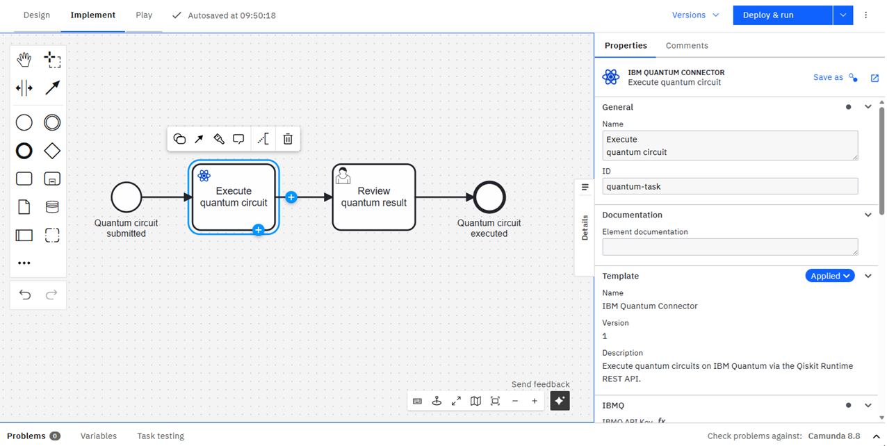

# IBM Quantum Connector for Camunda 8 ⚛️

*TODO: slogan 🚀*

[](https://github.com/wederbn/ibmq-connector-camunda-8/actions/workflows/build.yml)
[](https://docs.camunda.io/)
[](https://marketplace.camunda.com/en-US/listing?q=IBMQ&page=1)
[](https://envite.de/)
[](/LICENSE)

TODO: general description

An [example workflow](example/ibmq-example-workflow.bpmn) is provided in the `example/` directory.
It includes a start event with an input form for all relevant connector parameters,
the IBM Quantum Connector service task, a user task for reviewing the result, and an end event.
Follow the steps under [How to Run](#-how-to-run), and then, import the file into Camunda Modeler.



---

# Table of Contents

* 🚀 [How to Run](#-how-to-run)
* 📚 [Connector Documentation](#-connector-documentation)
    * [Getting Started](docs/getting-started.md)
    * [Configuration Properties for the Connector](docs/configuration-properties.md)
    * [Use Predefined Quantum Algorithms](docs/use-predefined-algorithms.md)
    * [Example Use Cases & HowTos](docs/usecases.md)
* 🛠️ [Development & Project Setup](#-development--project-setup)

---

## 🚀 How to Run

### Prerequisites

- **Java 21**
- **Maven 3.8+**
- A running **Camunda 8** instance (SaaS or Self-Managed)
- An **IBM Quantum** account with an API key (the key can be obtained [here](https://quantum.cloud.ibm.com/))

### 1. Configure the Connector

Edit `src/main/resources/application.properties` with your Camunda 8 connection details:

```properties
camunda.client.grpc-address=https://<your-zeebe-address>
camunda.client.rest-address=https://<your-zeebe-rest-address>
camunda.client.auth.client-id=<your-client-id>
camunda.client.auth.client-secret=<your-client-secret>
```

### 2. Build and Run

```bash
mvn spring-boot:run
```

The connector registers itself as a Camunda job worker and starts polling for jobs of type `de.envite:ibmq-connector:1`.

### 3. Import the Element Template

Import `element-templates/ibmq-connector.json` into your Camunda Modeler to get the pre-configured service task with all input fields and the quantum icon:

- **Camunda Web Modeler**: go to your project → *Create new* → *Upload files* → select `element-templates/ibmq-connector.json`. Afterward, open the element template and publish it to the project or organization.
- **Camunda Desktop Modeler**: copy the file into the `resources/element-templates` directory of the modeler.

### 4. Model and Deploy a Process

An [example workflow](example/ibmq-example-workflow.bpmn) is provided in `example/`.
In case you published the element template to a project, upload the workflow to the **same project**.
Web Modeler will then automatically link the template and display the connector with its icon.
If the element template is not yet in the project, the task will appear as a plain service task and must be linked manually.
Ensure that the element template is published using version number `1`, as this version is used in the example workflow.

To model your own process, add a service task and apply the **IBM Quantum Connector** element template, then fill in the required properties.
The documentation of all provided configuration properties can be found [here](docs/configuration-properties.md).

## 📚 Connector Documentation

Learn how to effectively use the connectors in your processes:
* [Getting Started](docs/getting-started.md): Details of how to get started with the IBM Quantum Connector
* [Configuration Properties for the Connector](docs/configuration-properties.md): Summary of all configuration properties of the connector
* [Use Predefined Quantum Algorithms](docs/use-predefined-algorithms.md): Information about how to execute predefined quantum algorithms using the IBM Quantum Connector by utilizing a circuit generating side-car.
* [Example Use Cases & HowTos](docs/usecases.md): TODO

## 🛠️ Development & Project Setup

TODO

## License

This project is developed under

[](/LICENSE)

## Sponsors and Customers

[](https://envite.de/)
