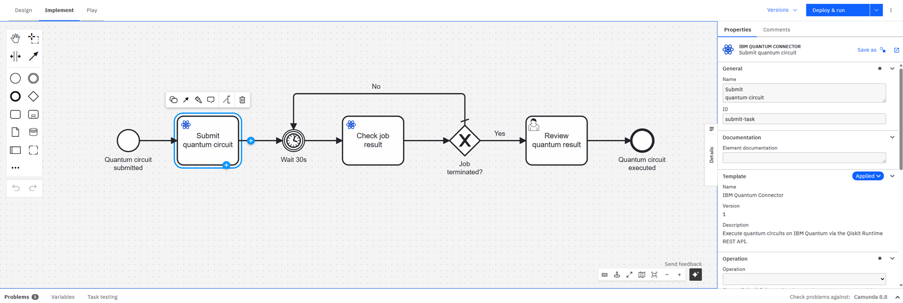

# IBM Quantum Connector for Camunda 8 ⚛️

*TODO: slogan 🚀*

[](https://github.com/wederbn/ibmq-connector-camunda-8/actions/workflows/build.yml)
[](https://docs.camunda.io/)
[](https://marketplace.camunda.com/en-US/listing?q=IBMQ&page=1)
[](https://envite.de/)
[](/LICENSE)

TODO: general description

Two example workflows are provided in the `example/getting-started/` directory:

- **[Blocking](example/getting-started/ibmq-example-workflow_blocking.bpmn)** — submits a circuit and blocks the connector thread until the job reaches a terminal state (`waitForResult=true`). This is simple to use, but quantum jobs on real hardware backends may queue for longer than the configured timeout, causing the connector to throw a timeout exception and Camunda to re-execute the circuit. Further, this can lead to an incidents if all retries are used.
- **[Polling](example/getting-started/ibmq-example-workflow_polling.bpmn)** — submits the job without waiting (`waitForResult=false`), then polls the result every 30 seconds via a BPMN timer loop using the `GET_JOB_RESULT` operation. Recommended for real hardware backends where execution time is unpredictable.

Both include a start event with an input form for all relevant connector parameters, the IBM Quantum Connector service task, a user task for reviewing the result, and an end event.
The polling example workflow can be seen bellow.
Thereby, the quantum circuit is first submitted using the IBM Quantum Connector, then a loop is entered, checking for the current state of the quantum job every 30s using the connector until it reaches a terminated state (completed, canceled, error).
Follow the steps under [How to Run](#-how-to-run), and then import the file into Camunda Modeler.



---

# Table of Contents

* 🚀 [How to Run](#-how-to-run)
* 📚 [Connector Documentation](#-connector-documentation)
    * [Getting Started](docs/getting-started.md)
    * [Connector Configuration and Output Reference](docs/connector-reference.md)
    * [Using Predefined Quantum Algorithms via a Sidecar](docs/use-predefined-algorithms.md)
    * [Example Use Cases & HowTos](docs/usecases.md)
* 🛠️ [Development & Project Setup](#-development--project-setup)

---

## 🚀 How to Run

### Prerequisites

- **Java 21**
- **Maven 3.8+**
- A running **Camunda 8** instance (SaaS or Self-Managed)
- An **IBM Quantum** account with an API key (the key can be obtained [here](https://quantum.cloud.ibm.com/))

### 1. Configure the Connector

Edit `src/main/resources/application.properties` with your Camunda 8 connection details:

```properties
camunda.client.grpc-address=grpcs://<cluster-id>.<region>.zeebe.camunda.io:443
camunda.client.rest-address=https://<region>.zeebe.camunda.io/<cluster-id>
camunda.client.auth.client-id=<your-client-id>
camunda.client.auth.client-secret=<your-client-secret>
camunda.client.cloud.cluster-id=<cluster-id>
camunda.client.cloud.region=<region>
```

### 2. Build and Run

```bash
mvn spring-boot:run
```

The connector registers itself as a Camunda job worker and starts polling for jobs of type `de.envite:ibmq-connector:1`.

### 3. Import the Element Template

Import `element-templates/ibmq-connector.json` into your Camunda Modeler to get the pre-configured service task with all input fields and the quantum icon:

- **Camunda Web Modeler**: go to your project → *Create new* → *Upload files* → select `element-templates/ibmq-connector.json`. Afterward, open the element template and publish it to the project or organization.
- **Camunda Desktop Modeler**: copy the file into the `resources/element-templates` directory of the modeler.

### 4. Model and Deploy a Process

Example workflows are provided in `example/getting-started/` (see [above](#ibm-quantum-connector-for-camunda-8-) for a description of each).
The connector can automatically deploy the example workflows and their forms to your Camunda cluster on startup by enabling the following property in `application.properties`:

```properties
ibmq.example.deploy=true
```

> **Note:** Keep this set to `false` (the default) in production environments.

If you prefer to deploy manually, upload the desired workflow from `example/getting-started/` together with `example/getting-started/ibmq-input-form.form` and `example/getting-started/ibmq-result-form.form` to your cluster — either via Camunda Web Modeler or the Zeebe API.
In case you published the element template to a project, upload the workflow to the **same project** so Web Modeler automatically links the template and displays the connector with its icon.

To model your own process, add a service task and apply the **IBM Quantum Connector** element template, then fill in the required properties.
The full configuration and output reference can be found [here](docs/connector-reference.md).

## 📚 Connector Documentation

Learn how to effectively use the connectors in your processes:
* [Getting Started](docs/getting-started.md): Details of how to get started with the IBM Quantum Connector
* [Connector Configuration and Output Reference](docs/connector-reference.md): All configuration properties and the connector output fields available for use in result expressions and downstream tasks
* [Using Predefined Quantum Algorithms via a Sidecar](docs/use-predefined-algorithms.md): Architecture and integration guide for using a Qiskit sidecar to generate quantum circuits from classical problem inputs and post-process measurement results — including support for variational algorithms (VQE, QAOA) with classical optimizer loops.
* [Example Use Cases & HowTos](docs/usecases.md): End-to-end workflow examples including Grover's Search

## 🛠️ Development & Project Setup

TODO

## License

This project is developed under

[](/LICENSE)

## Sponsors and Customers

[](https://envite.de/)
