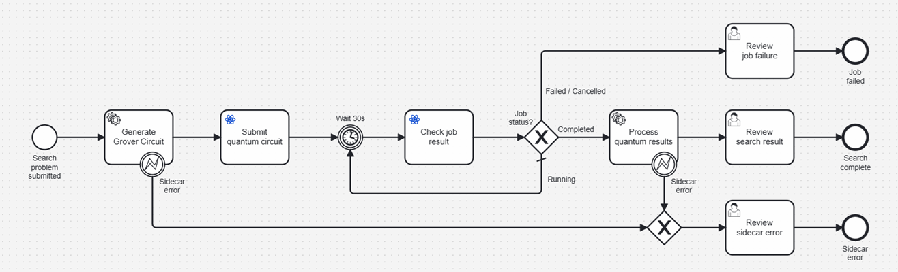
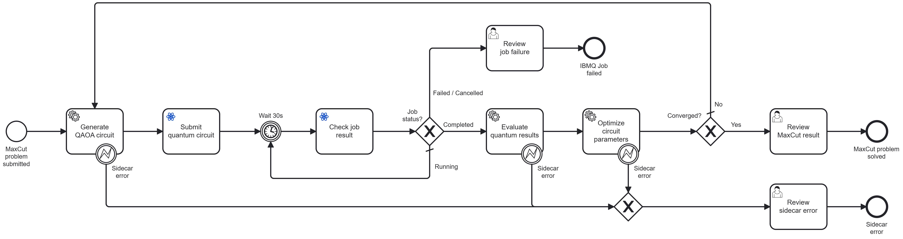

# Example Use Cases & HowTos

The following examples demonstrate how to use the IBM Quantum Connector and the [IBM Quantum Algorithm Accelerator pattern](use-predefined-algorithms.md) in real workflows.
Each example includes a ready-to-run BPMN workflow, element templates, and setup instructions.

| Example | Algorithm type | Reference                                               |
|---|---|---------------------------------------------------------|
| [Grover's Search](#grovers-search) | One-shot | [Grover, 1996](https://arxiv.org/abs/quant-ph/9605043)  |
| [QAOA / MaxCut](#qaoa--maxcut) | Variational | [Farhi et al., 2014](https://arxiv.org/abs/1411.4028)   |

---

## Grover's Search

**Example workflow:** [`example/predefined-algorithms/grover/grover-search-workflow.bpmn`](../example/predefined-algorithms/grover/grover-search-workflow.bpmn)

Grover's search algorithm finds a marked element in an unstructured search space of size N with O(√N) quantum circuit evaluations, compared to O(N) for a classical linear scan.
This example demonstrates the [IBM Quantum Algorithm Accelerator pattern](use-predefined-algorithms.md): a lightweight Python sidecar translates a classical problem description into an executable quantum circuit and interprets the raw measurement results back into a classical answer — the IBM Quantum Connector itself is unchanged.

### Problem

Given a target bitstring (e.g. `"11"`), find it in the search space of all 2-qubit bitstrings using a single quantum circuit execution.

### Workflow structure



```
Start Form → Generate Circuit → Submit Job → [Poll Loop] → Process Results → Review → End
```

| Step | Component | What it does |
|---|---|---|
| Start Form | Camunda Form | Collects `problem` (target bitstring, shots), `sidecarUrl`, `apiKey`, `ibmqUrl`, `ibmqInstance`, `backend` |
| Generate Circuit | HTTP Connector → Sidecar `/generate-circuit` | Builds and transpiles a Grover circuit to native IBM Quantum basis gates; returns `circuit` (OpenQASM 3) and `shots` |
| Submit Job | IBM Quantum Connector (`SUBMIT_JOB`) | Submits the circuit to the selected IBM Quantum backend; returns `ibmqJobId` |
| Poll Loop | Timer + IBM Quantum Connector (`GET_JOB_RESULT`) | Waits 30 s, checks job status, loops until terminal state |
| Process Results | HTTP Connector → Sidecar `/process-results` | Extracts the highest-frequency bitstring from the Sampler output; returns `classicalResult` with `answer`, `found`, `confidence`, and `counts` |
| Review | User Task | Presents the search result to a human |

### Process variables

| Variable | Set by | Used by |
|---|---|---|
| `problem` | Start form | Generate Circuit, Process Results |
| `sidecarUrl` | Start form | Generate Circuit, Process Results |
| `apiKey` | Start form | Submit Job, Check Job |
| `ibmqUrl` | Start form | Submit Job, Check Job |
| `ibmqInstance` | Start form | Submit Job, Check Job |
| `backend` | Start form | Submit Job |
| `circuit` | Generate Circuit | Submit Job |
| `shots` | Generate Circuit | Submit Job |
| `ibmqJobId` | Submit Job | Check Job |
| `ibmqStatus` | Check Job | Poll gateway |
| `ibmqResult` | Check Job | Process Results |
| `classicalResult` | Process Results | Review user task |

### Running the example

> **Warning (Camunda SaaS only):** The sidecar is called by the built-in Camunda HTTP Connector (`io.camunda:http-json:1`), which executes inside the **Camunda SaaS** infrastructure — not locally.
> This means `http://quantum-sidecar:5000` is not reachable from the cloud.
> The sidecar must be publicly accessible when using Camunda SaaS.
>
> When running a **local Camunda setup** (e.g. via Docker), the HTTP Connector executes locally and can reach the sidecar by its Docker service name without any extra steps.
>
> For **Camunda SaaS**, use a tunneling tool such as [ngrok](https://ngrok.com/) to expose the sidecar during testing:
> ```bash
> ngrok http 5000
> ```
> Then use the generated public URL (e.g. `https://xxxx.ngrok.io`) as the `sidecarUrl` below.
> For production deployments, host the sidecar container on a publicly reachable endpoint.

1. Start the connector and sidecar:
   ```bash
   cd example/predefined-algorithms
   docker compose up --build
   ```

2. Deploy the workflow and forms to your Camunda cluster by uploading the files from `example/predefined-algorithms/grover/` via the Camunda Web Modeler.

3. Start a process instance via Camunda Tasklist with the following start form inputs:

   | Field | Example value |
   |---|---|
   | Target bitstring | `11` |
   | Shots | `1024` |
   | Sidecar URL | your public sidecar URL, e.g. `https://xxxx.ngrok.io` |
   | IBM Quantum API Key | `{{secrets.IBMQ_API_KEY}}` |
   | IBM Quantum URL | `https://quantum.cloud.ibm.com/api` |
   | IBM Quantum Instance | `{{secrets.IBMQ_INSTANCE}}` |
   | Backend | your backend name, e.g. `ibm_brisbane` |

4. After the quantum job completes, a Review user task appears in Tasklist. `classicalResult.answer` should equal the target bitstring, with `classicalResult.found = true` and a high `classicalResult.confidence`.

---

---

## QAOA / MaxCut

**Example workflow:** [`example/predefined-algorithms/qaoa/qaoa-max-cut-workflow.bpmn`](../example/predefined-algorithms/qaoa/qaoa-max-cut-workflow.bpmn)

The Quantum Approximate Optimization Algorithm (QAOA) is a variational quantum algorithm for combinatorial optimization problems.
This example solves the [MaxCut problem](https://en.wikipedia.org/wiki/Maximum_cut): partition the nodes of a graph into two sets to maximize the number of edges crossing the cut.
It demonstrates the variational quantum algorithm pattern, i.e., the workflow loops, running a quantum circuit and a classical optimizer step on each iteration, until the optimizer converges.

### Problem

Given an undirected weighted graph (adjacency matrix), find the node partition that maximizes the total weight of edges between the two partitions.

### Workflow structure



```
Start Form → Generate Circuit → Submit Job → [Poll Loop] → Evaluate Results → SPSA Optimize
                ▲                                                                    │
                │                                                      not converged │
                └────────────────────────────────────────────────────────────────────┘
                                                                           converged ↓
                                                                               Review Result → End
```

| Step | Component | What it does |
|---|---|---|
| Start Form | Camunda Form | Collects `problem` (adj_matrix JSON, p, shots), `sidecarUrl`, IBM Quantum credentials |
| Generate Circuit | HTTP Connector → Sidecar `/generate-circuit` | Builds and transpiles a QAOA MaxCut circuit using Qiskit; backend properties (basis gates, coupling map) are auto-fetched from IBM Quantum; returns `circuit` (OpenQASM 3), `shots`, and the `currentParams` used |
| Submit Job | IBM Quantum Connector (`SUBMIT_JOB`) | Submits the circuit to the selected IBM Quantum backend; returns `ibmqJobId` |
| Poll Loop | Timer + IBM Quantum Connector (`GET_JOB_RESULT`) | Waits 30 s, checks job status, loops until terminal state |
| Evaluate Results | HTTP Connector → Sidecar `/process-results` | Extracts bitstring counts, delegates to the objective-evaluation-service; returns `objectiveValue` (negative MaxCut weight) |
| SPSA Optimize | HTTP Connector → Sidecar `/optimize` | Runs one stateless SPSA step; returns `converged`, `next_params`/`optimal_params`, and the opaque `optimizer_state` |
| Review Result | User Task | Presents `objectiveValue`, `iteration`, and the last job URL |

### SPSA loop mechanics

Each SPSA gradient estimate requires three sequential IBM Quantum jobs, so each "SPSA step" maps to three BPMN loop iterations:

| BPMN iteration | Params evaluated | Sidecar response |
|---|---|---|
| k+0 | θ_k | θ_k + c_k·Δ_k (phase: `gradient_plus`) |
| k+1 | θ_k + c_k·Δ_k | θ_k − c_k·Δ_k (phase: `gradient_minus`) |
| k+2 | θ_k − c_k·Δ_k | θ_{k+1} = θ_k − a_k·ĝ (phase: `step`) |

The `optimizer_state` blob returned by each `/optimize` call is passed back unchanged on the next call, keeping the sidecar stateless.

### Process variables

| Variable | Set by | Used by |
|---|---|---|
| `problem` | Start form | Generate Circuit, Evaluate Results, Optimize |
| `sidecarUrl` | Start form | Generate Circuit, Evaluate Results, Optimize |
| `apiKey` | Start form | Generate Circuit, Submit Job, Check Job |
| `ibmqUrl` | Start form | Submit Job, Check Job |
| `ibmqInstance` | Start form | Generate Circuit, Submit Job, Check Job |
| `backend` | Start form | Generate Circuit, Submit Job |
| `circuit` | Generate Circuit | Submit Job |
| `shots` | Generate Circuit | Submit Job |
| `currentParams` | Generate Circuit (first call), Optimize (subsequent calls) | Generate Circuit, Optimize |
| `ibmqJobId` | Submit Job | Check Job |
| `ibmqStatus` | Check Job | Poll gateway |
| `ibmqResult` | Check Job | Evaluate Results |
| `objectiveValue` | Evaluate Results | Optimize |
| `counts` | Evaluate Results | (available for inspection) |
| `iteration` | Optimize | Optimize (next call), result form |
| `converged` | Optimize | Convergence gateway |
| `optimizerState` | Optimize | Optimize (next call) |
| `optimalParams` | Optimize (on convergence) | (available for inspection) |

### Running the example

> **Warning (Camunda SaaS only):** The sidecar must be publicly accessible when using Camunda SaaS. See the [Grover example](#running-the-example) for details on using ngrok during testing.

1. Start the connector, sidecar, and QAOA backend services:
   ```bash
   cd example/predefined-algorithms
   docker compose --profile qaoa up --build
   ```
   The `--profile qaoa` flag additionally starts the [`objective-evaluation-service`](https://github.com/UST-QuAntiL/objective-evaluation-service) (port 5072), which the sidecar delegates QAOA objective evaluation to. Circuit generation is handled locally by the sidecar using Qiskit, with backend properties (basis gates, coupling map) auto-fetched from IBM Quantum at runtime. The objective-evaluation-service is not needed for the Grover example.

2. Deploy the workflow and forms to your Camunda cluster by uploading the files from `example/predefined-algorithms/qaoa/` via the Camunda Web Modeler.

3. Start a process instance via Camunda Tasklist with the following start form inputs:

   | Field | Example value |
   |---|---|
   | Adjacency Matrix | `[[0,1,1,0],[1,0,1,1],[1,1,0,1],[0,1,1,0]]` |
   | QAOA Depth (p) | `1` |
   | Shots | `1024` |
   | Sidecar URL | your public sidecar URL, e.g. `https://xxxx.ngrok.io` |
   | IBM Quantum API Key | `{{secrets.IBMQ_API_KEY}}` |
   | IBM Quantum URL | `https://quantum.cloud.ibm.com/api` |
   | IBM Quantum Instance | `{{secrets.IBMQ_INSTANCE}}` |
   | Backend | your backend name, e.g. `ibm_brisbane` |

4. The workflow runs multiple IBM Quantum jobs. After the SPSA optimizer converges, a Review user task appears in Tasklist. `objectiveValue` shows the best MaxCut objective found.